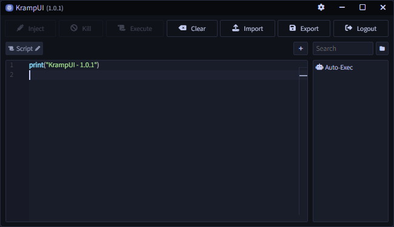

## 💻 - KrampUI
Simple and lightweight frontend for Krampus/Ro-Exec. Allowing you to easily manage all your scripts and giving you multiple tabs to maximize your workflow.

    

## 📋 - Download
- [Standalone](https://git.snipcola.com/snipcola/KrampUI/releases/download/latest/krampui.exe)
- [Installer](https://git.snipcola.com/snipcola/KrampUI/releases/download/latest/krampui-installer.msi)

## 💻 - Compilation
1. Ensure you have `cargo` (`rustup`), `node`, and `npm` installed.
2. Run `npm install`.
3. Run `npm run start` or `npm run build` depending on what you need.
4. Access the executable at `src-tauri/target/release` or `src-tauri/target/debug`.

## ⚠️ - Disclaimer
This repository does not contain Krampus, nor does this project allow you to get it for free. You will need to purchase Krampus first, so you can use the login token with this application.